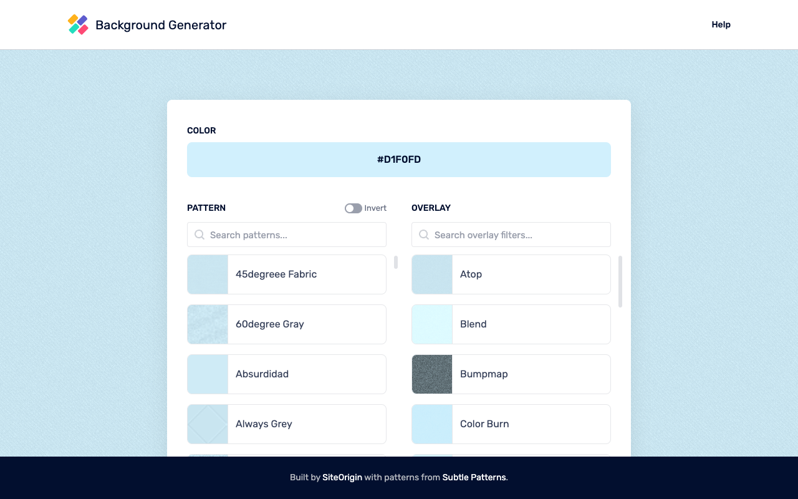

# Background Generator

> After years of serving the creative community at bg.siteorigin.com, we're excited to open source the Background Generator! While the hosted version will be sunset, we believe the best way to preserve this tool is to give it to the community who has supported it. Deploy it locally, host it yourself, or contribute to make it even better - it's now yours to shape and maintain.

A powerful web-based tool for creating beautiful patterned backgrounds with customizable colors, blend modes, and effects. Perfect for designers, developers, and anyone who needs unique background images for their projects.



## Features

- 🎨 **450+ Patterns**: Extensive library of textures, geometric patterns, fabrics, and more
- 🎯 **Real-time Preview**: See changes instantly as you customize
- 🌈 **Full Color Control**: Chrome-style color picker with hex support
- ✨ **30+ Blend Modes**: Professional image blending options from ImageMagick
- 📱 **Responsive Design**: Works on desktop and mobile devices
- 💾 **Pattern History**: Save and revisit your favorite combinations
- 📤 **High-Resolution Export**: Download in standard or @2x resolution

## Quick Start

### Prerequisites

- PHP 8.1+ with ImageMagick extension
- Node.js 14+ and npm
- Composer
- MySQL/MariaDB (or SQLite for simpler setup)

### Local Development Setup

1. **Clone the repository**
   ```bash
   git clone https://github.com/siteorigin/background-generator.git
   cd background-generator
   ```

2. **Install PHP dependencies**
   ```bash
   composer install
   ```

3. **Install frontend dependencies**
   ```bash
   npm install
   ```

4. **Configure environment**
   ```bash
   cp .env.example .env
   php artisan key:generate
   ```

5. **Update .env file**
   ```env
   APP_NAME="Background Generator"
   APP_URL=http://localhost:8000
   
   # For SQLite (simpler setup)
   DB_CONNECTION=sqlite
   DB_DATABASE=database/database.sqlite
   
   # Or for MySQL
   DB_CONNECTION=mysql
   DB_HOST=127.0.0.1
   DB_PORT=3306
   DB_DATABASE=background_generator
   DB_USERNAME=your_username
   DB_PASSWORD=your_password
   ```

6. **Create database** (if using SQLite)
   ```bash
   touch database/database.sqlite
   ```

7. **Run migrations**
   ```bash
   php artisan migrate
   ```

8. **Build frontend assets**
   ```bash
   npm run dev
   ```

9. **Start the development server**
   ```bash
   # Option 1: Laravel's built-in server
   php artisan serve
   
   # Option 2: Laravel Octane (higher performance)
   php artisan octane:start
   ```

10. **Visit http://localhost:8000**

## Production Deployment

### Traditional VPS Deployment

#### Ubuntu/Debian Setup

1. **Install system dependencies**
   ```bash
   sudo apt update
   sudo apt install -y php8.1-fpm php8.1-cli php8.1-common \
     php8.1-mysql php8.1-xml php8.1-curl php8.1-mbstring \
     php8.1-imagick nginx mysql-server nodejs npm composer
   ```

2. **Configure Nginx**
   ```nginx
   server {
       listen 80;
       server_name yourdomain.com;
       root /var/www/background-generator/public;
       
       index index.php;
       
       location / {
           try_files $uri $uri/ /index.php?$query_string;
       }
       
       location ~ \.php$ {
           fastcgi_pass unix:/var/run/php/php8.1-fpm.sock;
           fastcgi_index index.php;
           fastcgi_param SCRIPT_FILENAME $realpath_root$fastcgi_script_name;
           include fastcgi_params;
       }
   }
   ```

3. **Set permissions**
   ```bash
   sudo chown -R www-data:www-data storage bootstrap/cache
   sudo chmod -R 775 storage bootstrap/cache
   ```

### Platform-Specific Deployments

#### Heroku

1. **Create Procfile**
   ```
   web: vendor/bin/heroku-php-apache2 public/
   ```

2. **Add buildpacks**
   ```bash
   heroku buildpacks:add heroku/php
   heroku buildpacks:add heroku/nodejs
   ```

3. **Deploy**
   ```bash
   git push heroku main
   ```

#### DigitalOcean App Platform

1. Create new app from GitHub repository
2. Add environment variables in the app settings
3. Set build command: `composer install && npm install && npm run production`
4. Set run command: `php artisan octane:start --port=8080`

#### Railway.app

1. Connect GitHub repository
2. Railway will auto-detect Laravel and configure accordingly
3. Add ImageMagick to nixpacks.toml:
   ```toml
   [phases.setup]
   aptPkgs = ["imagemagick", "php-imagick"]
   ```

## Configuration

### Adding New Patterns

1. Add pattern images to `storage/patterns/`
2. Use PNG format with transparent backgrounds
3. Provide both standard and @2x versions for best quality

### Performance Optimization

- **Laravel Octane**: Already configured for high-performance with RoadRunner
- **Caching**: Enable Redis for better performance
- **CDN**: Serve pattern files through a CDN for faster loading

### Memory Requirements

- Minimum: 128MB PHP memory limit
- Recommended: 256MB+ for comfortable operation
- Adjust in `php.ini`: `memory_limit = 256M`

## Technical Architecture

- **Backend**: Laravel 8.x with ImageMagick for image processing
- **Frontend**: Vue.js 2.x SPA with Tailwind CSS
- **Image Processing**: Custom ImageMagick wrapper for pattern compositing
- **Performance**: Laravel Octane with RoadRunner for high-throughput

## Contributing

We welcome contributions! Here's how you can help:

1. **Add New Patterns**: Submit PRs with new pattern designs
2. **Improve Features**: Enhance existing functionality
3. **Fix Bugs**: Help us squash any issues
4. **Documentation**: Improve setup guides and documentation

### Development Guidelines

- Follow PSR-1, PSR-2, and PSR-12 for PHP code
- Run `composer format` before committing
- Test your changes thoroughly
- Update documentation as needed

## License

This project is open source and available under the [MIT License](LICENSE).

## Acknowledgments

Thank you to everyone who has used and supported the Background Generator over the years. Your creativity and feedback have made this tool what it is today. We're excited to see how the community will continue to improve and maintain it!

The pattern library includes designs originally released under Creative Commons by [Subtle Patterns](https://www.toptal.com/designers/subtlepatterns/), providing a rich collection of high-quality textures and backgrounds.

---

Made with ❤️ by [SiteOrigin](https://siteorigin.com)
